# Pacmann-Super-Cashier
This is python-based project to develop self-cashier program for fictious supermarket.

## Problem Background

A client needed an automated cashier system for his supermarket. Generally, the system allows customers of his supermarket to serve themselves, just like in an offline supermarket.

## Program Requirements

Client’s request has minimum requirements, such as adding items, updating item name and quantities and deleting items. However, I decided to go further and develop solutions beyond what is requested.

I connect the system with MySQL database. For this purpose, free version of online MySQL database environment is used which is provided by [Railway.app](https://firstsiteguide.com/what-is-rotating-proxy/](https://railway.app/new))</i>. In order to interact with database, simple SQL scripts of are implemented. Lastly, the app with which system admin as well as customers interact are developed with python in the form of CLI (Command Line Interface).

Below is the simple table schema developed for this purpose.

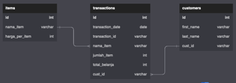

## Modules Description

1. Module "db.py" contains functions and SQL script of Data Manipulation Languange (DML) to do CRUD operation.
2. Module "ddl.sql" contains simple SQL script of Data definition language (DDL), which include schema and tables.
3. Module "dataseed.py" contains initial data to populate database on the first initialization.
4. Module "transaksi.py" contains Cashier class which defines functions for transaction process carried out by customers.
5. Module "customer.py" contains Customer class which defines function for customer login/sign-up process. This is also a parent class of Trasaksi class.
6. Module "admin.py" contains Admin class which defines functions for transaction process carried out by system admin.
7. Module "helper.py" contains helping functions, such as function to convert tuple to list and list to tuple.
8. Module "table.py" contains function to sytle visualization table and output message.
9. Module "main.py" contains main page of the program and also function to run the program.

## Flowchart

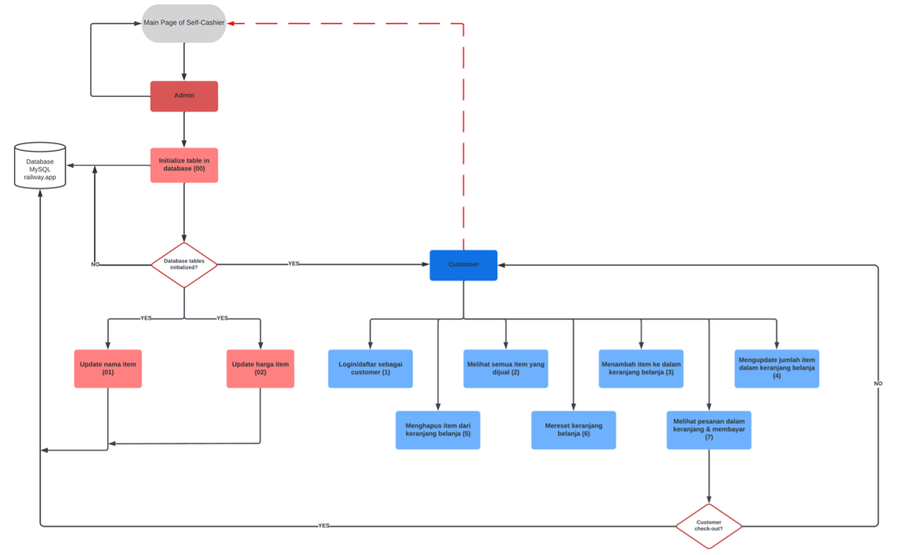

## How to use it?

1. Create free MySQL database environment at [Railway.app](https://firstsiteguide.com/what-is-rotating-proxy/](https://railway.app/new))</i> which is free for 24hr.
2. Create ".env" file or just input connection credentials given by Railway.app in the module "db.py". You get those connection credential from the Railway.app page once you create your environment. 

This will be automatically erased by Railway.app every 24hr, so I don’t have any concern sharing it here.

3. To start the program, the command is: <b>"python main.py"</b>.
4. The program could not be run before initializing database/database table (see below how to initialize the database).

## Features & Test Case

In general, the app is categorized based on its users, namely system admin and normal customer. However, I didn’t implement system admin verification for the sake of simplicity.

### A. System admin

#### 1. Initialize tables in the database by inputting “00”
   
The program could not be run before initializing database/database table. Thus, at the very first run, you have to input ‘’00’’ in the app in order to set-up MySQL database environment and populate the table with initial data.

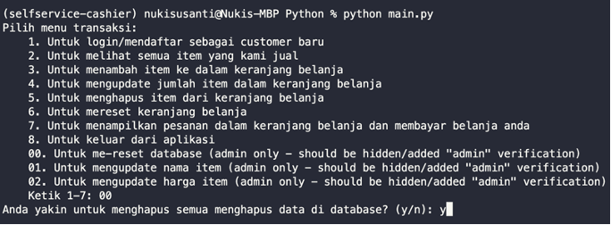

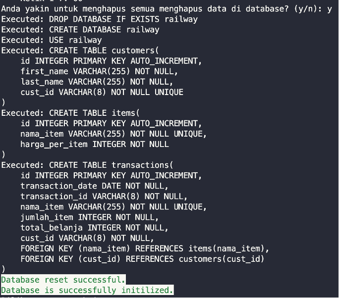

This step will initiate tables in the database and populate it with initial data as shown below.

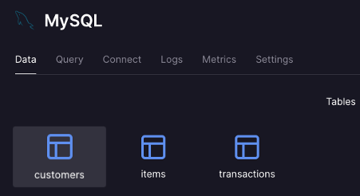 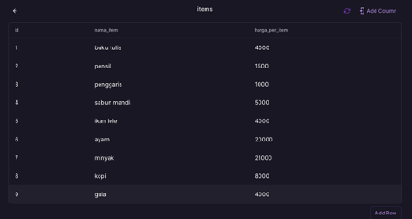

 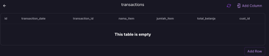
 
#### 2. Update item name by inputting “01”

Database is also successfully updated.

#### 3.	Update item price by inputting “02”
After changing “gula” to “garam”, we changed its price from Rp. 4,000 to Rp. 2,000.

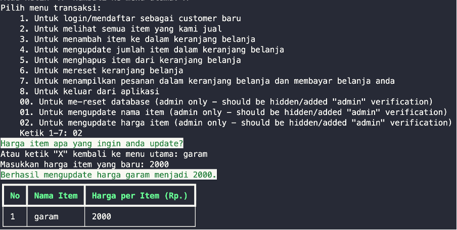

Database is also successfully updated.

### B.	Customer

#### 1.	Login for existing customer and sign-up for new customer inputting "1"
   
In case customer is not logged-in or signed-up, he/she will be assigned cust_id of “guest”. They can still proceed to payment regardless they would like to login or signup.

##### New customer

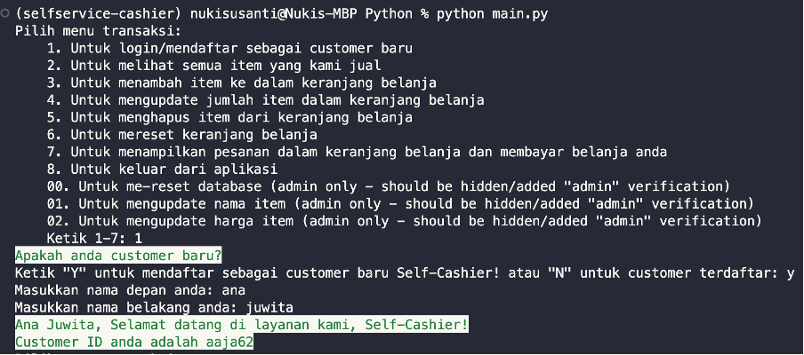

Her name is saved in database and her customer_id is automatically created.

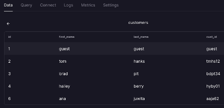

##### Old customer

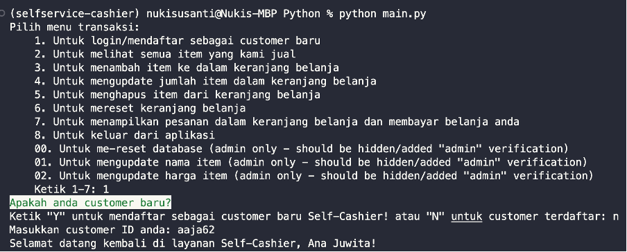

#### 2.	Display all items available in the supermarket inputting "2"
   
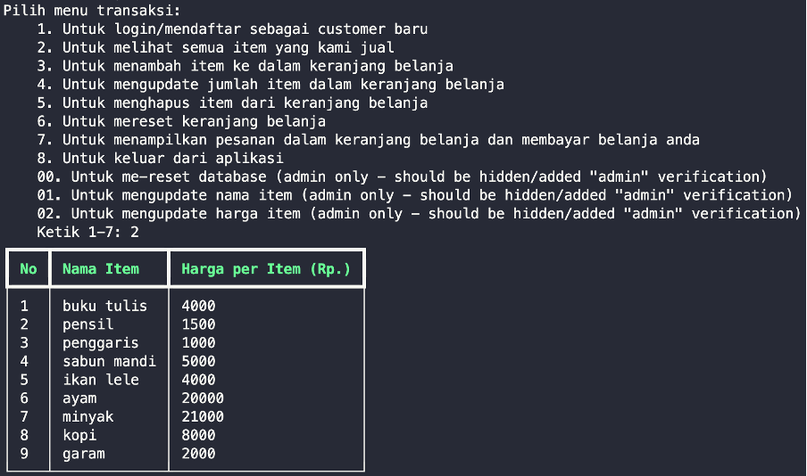
   
#### 3.	Adding items to shopping chart inputting "3"

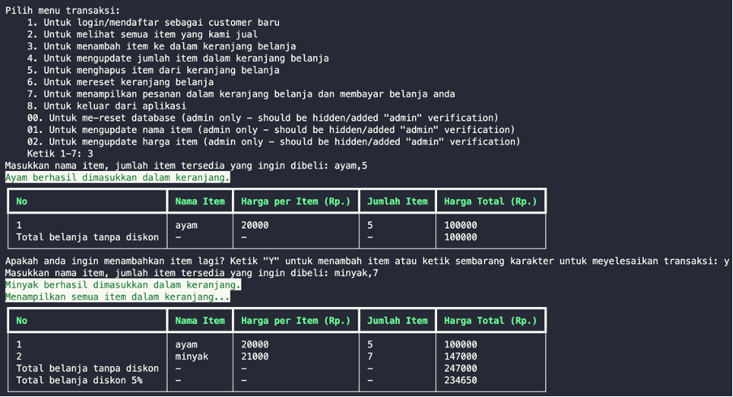

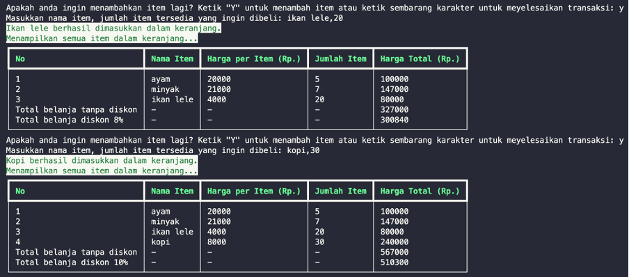

When the customer input something wrong or item name that is unavailable, the system will propose the similar item name, such as shown by the case below.

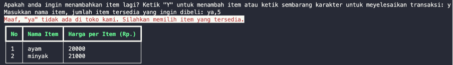
   
#### 4.	Update item quantity inside shopping chart inputting "4"

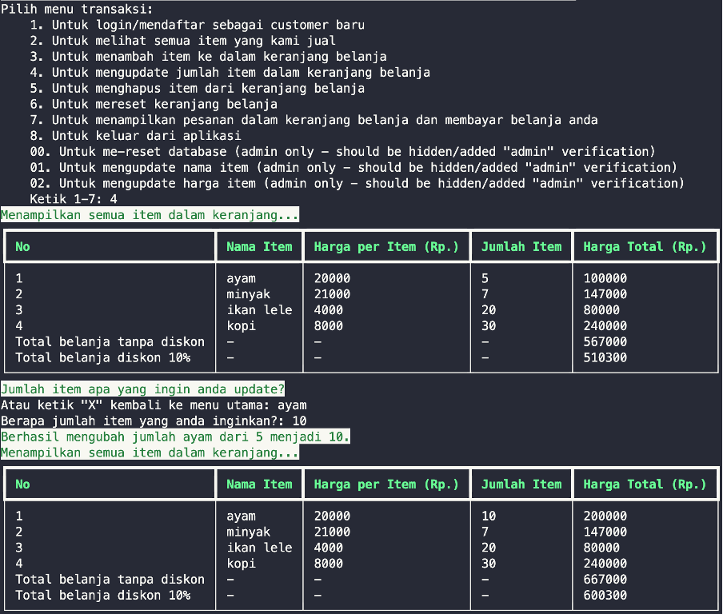

If customer types item that is not available in the shopping chart, a proper message will be shown by the system. Customer will be also shown the whole shopping chart.

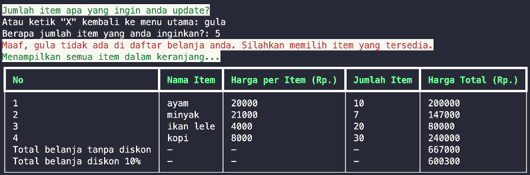

#### 5.	Delete item from shopping chart by inputting "5"

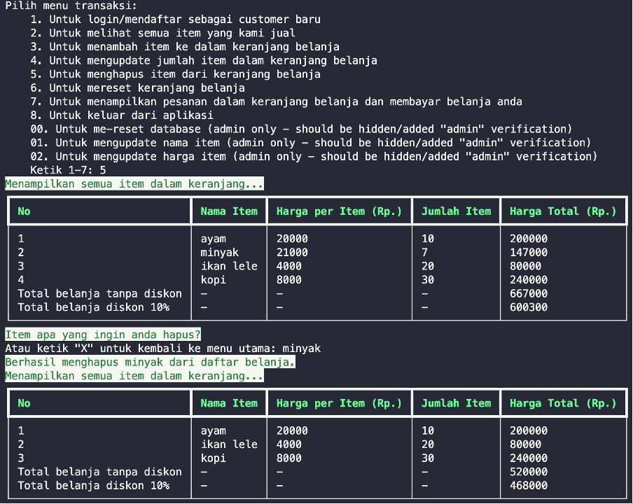

Likewise, error is handled when customer enters item that is unavailable in his/her shopping chart.

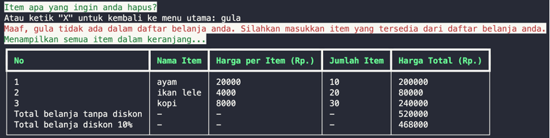

#### 6.	Reset/empty shopping chart by inputting "6"

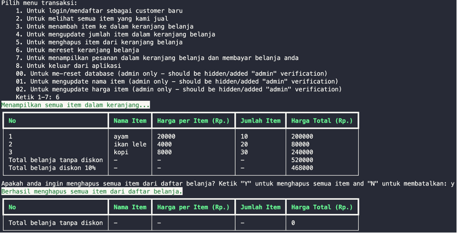

#### 7.	Display the shopping chart and proceed to payment by inputting "7"

Transaction data is then saved in database once customer agrees on their order in the shopping chart. 

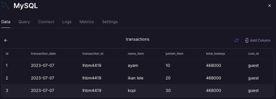
