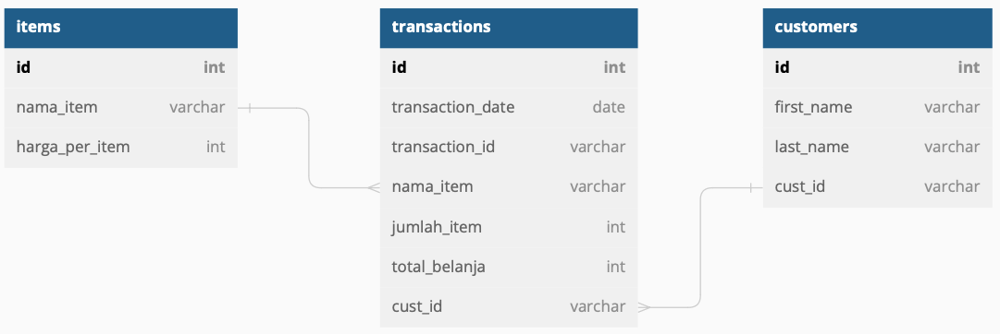
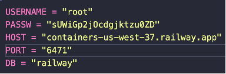
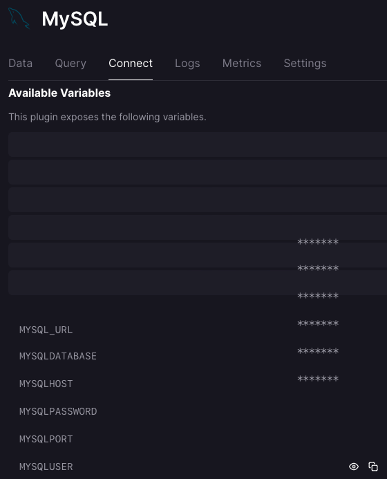
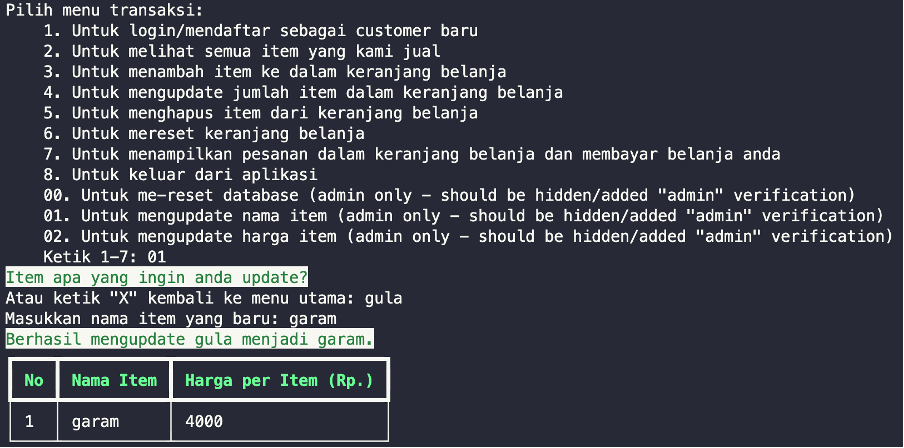
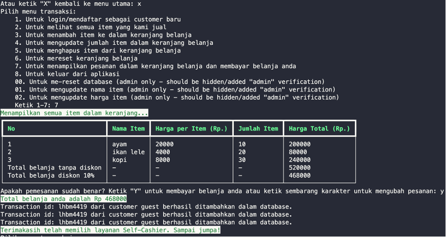

# Pacmann-Super-Cashier
This is python-based project to develop self-cashier program for fictious supermarket.

To start the program, the command is: <b>"python main.py"</b>

## Problem Background

A client needed an automated cashier system for his supermarket. Generally, the system allows customers of his supermarket to serve themselves, just like in an offline supermarket.

## Program Requirements

Client’s request has minimum requirements, such as adding items, updating item name and quantities and deleting items. However, I decided to go further and develop solutions beyond what is requested.

I connect the system with MySQL database. For this purpose, free version of online MySQL database environment is used which is provided by [Railway.app](https://firstsiteguide.com/what-is-rotating-proxy/](https://railway.app/new))</i>. In order to interact with database, simple SQL scripts of CRUD (Create, Read, Update and Delete) are used. Lastly, the app with which system admin as well as customers interact are developed with python in the form of CLI (Command Line Interface).

Below is the simple table schema developed for this purpose.

## Flowchart

## Features

In general, the app is categorized based on its users, namely system admin and normal customer. However, I didn’t implement system admin verification for the sake of simplicity.

### A. System admin

#### 1. Initialize tables in the database by inputting “00”
   
Beforehand, you have to input your temporary credential of MySQL environment, as shown below. This will be automatically erased by Railway.app every 24hr, so I don’t have any concern sharing it here.

You get those connection credential from the Railway.app page once you create your environment.

The app could not be run before initializing database/database table. Thus, at the very first run, you have to input ‘’00’’ in the app in order to set-up MySQL database environment and populate the table with initial data.

This step will initiate tables in the database and populate it with initial data as shown below.

 

 
 
#### 2. Update item name by inputting “01”

Database is also successfully updated.

#### 3.	Update item price by inputting “02”
After changing “gula” to “garam”, we changed its price from Rp. 4,000 to Rp. 2,000.

Database is also successfully updated.

### B.	Customer

#### 1.	Login for existing customer and sign-up for new customer inputting "1"
   
In case customer is not logged-in or signed-up, he/she will be assigned cust_id of “guest”. They can still proceed to payment regardless they would like to login or signup.

##### New customer

Her name is saved in database and her customer_id is automatically created.

##### Old customer

#### 2.	Display all items available in the supermarket inputting "2"
   

   
#### 3.	Adding items to shopping chart inputting "3"

When the customer input something wrong or item name that is unavailable, the system will propose the similar item name, such as shown by the case below.

   
#### 4.	Update item quantity inside shopping chart inputting "4"

If customer types item that is not available in the shopping chart, a proper message will be shown by the system. Customer will be also shown the whole shopping chart.

#### 5.	Delete item from shopping chart by inputting "5"

Likewise, error is handled when customer enters item that is unavailable in his/her shopping chart.

#### 6.	Reset/empty shopping chart by inputting "6"

#### 7.	Display the shopping chart and proceed to payment by inputting "7"

Transaction data is then saved in database once customer agrees on their order in the shopping chart. 

